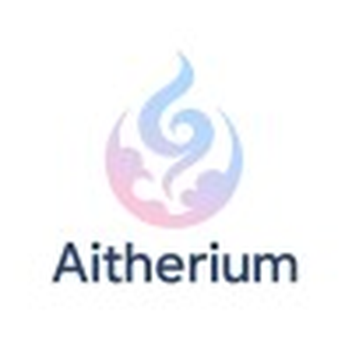

<div align="center">



# Aither ADK

**Build AI agent fleets. 3 lines, any backend, local or cloud.**

Effort-based model routing, 48 identities, knowledge graph memory, fleet orchestration.

[](https://pypi.org/project/aither-adk/)
[](https://aitherium.com)
[](#)
[](LICENSE)
[](#)

```bash
pip install aither-adk
```

[Get Started](#get-started) |
[Architecture](#architecture) |
[Agents](#agents) |
[ADK Docs](aither-adk/README.md) |
[Roadmap](ROADMAP.md) |
[aitherium.com](https://aitherium.com)

</div>

---

## Get Started

### 3 Lines to Your First Agent

```python
import asyncio
from adk import AitherAgent

async def main():
    agent = AitherAgent("aither")  # Auto-detects Ollama/vLLM on localhost
    response = await agent.chat("Hello! What can you help me with?")
    print(response.content)

asyncio.run(main())
```

Works with **Ollama, OpenAI, Anthropic, vLLM, LM Studio**, or any OpenAI-compatible API.

### Run as a Server

```bash
aither-serve --identity aither --port 8080
```

```bash
curl http://localhost:8080/v1/chat/completions \
  -H "Content-Type: application/json" \
  -d '{"model":"llama3.2","messages":[{"role":"user","content":"hello"}]}'
```

### Custom Tools

```python
from adk import AitherAgent, tool
from adk.llm import LLMRouter

@tool
def search_web(query: str) -> str:
    """Search the web for information."""
    return f"Results for: {query}"

agent = AitherAgent(
    "research-bot",
    identity="lyra",
    llm=LLMRouter(provider="openai", api_key="sk-..."),
)

response = await agent.run("Research AI agent frameworks in 2026")
```

### Fleet Mode

```bash
# Single agent
aither-serve --identity aither

# Fleet of specialists
aither-serve --agents aither,lyra,demiurge,hydra,athena

# OpenAI-compatible API
curl http://localhost:8080/v1/chat/completions \
  -d '{"model":"aither","messages":[{"role":"user","content":"hello"}]}'
```

---

## Architecture

The ADK is extracted from **AitherOS**, a full-stack agentic operating system with 208 microservices across 12 architectural layers.

```
LAYER 10  UI          AitherVeil (Next.js dashboard)
LAYER 9   TRAINING    Model lifecycle, daydream corpus, session harvesting
LAYER 8.5 MESH        Distributed node network, GPU sharing
LAYER 8   SECURITY    RBAC, secrets, flux monitoring, recovery
LAYER 7   AUTOMATION  Scheduler, demand, autonomic routines
LAYER 6   GPU         VRAM coordination, parallel inference, ComfyUI
LAYER 5   AGENTS      Agent council, forge dispatch, genesis orchestration
LAYER 3   COGNITION   Reasoning, judgment, flow control, will policies
LAYER 2   PERCEPTION  Voice, vision, portal, reflex
LAYER 1   CORE        Node, Pulse, Watch, MicroScheduler
LAYER 0   INFRA       Chronicle, Secrets, Nexus, Strata
```

**By the numbers:**
- 208 microservices (24 compound containers absorbing 92 sub-services)
- 65 Docker containers
- 2600+ passing tests across 120+ test files
- 43 specialist agents with persistent identity (17 ship with ADK)
- 170+ PowerShell automation scripts

---

## Agents

17 agent identities ship with `aither-adk` as package data:

| Agent | Role | Specialty |
|-------|------|-----------|
| **Aither** | Orchestrator | System coordination, delegation, awareness synthesis |
| **Atlas** | Project Manager | Roadmaps, research delegation, executive reporting |
| **Demiurge** | Code Craftsman | Code generation, refactoring, architecture |
| **Lyra** | Researcher | Knowledge synthesis, deep-dive analysis |
| **Athena** | Security Oracle | Vulnerability analysis, threat assessment |
| **Hydra** | Code Guardian | Multi-perspective code review, quality assurance |
| **Prometheus** | Worldbuilder | Simulation, game integration, procedural generation |
| **Apollo** | Performance | Optimization, benchmarking, profiling |
| **Iris** | Creative Muse | Image/video generation via ComfyUI |
| **Viviane** | Memory Guardian | Knowledge retrieval, context preservation |
| **Vera** | Content Creator | Writing, editing, social media |
| **Hera** | Community | Social engagement, publishing |
| **Morgana** | Secrets Keeper | Encryption, secure configuration |
| **Saga** | Documentation | Technical writing, knowledge base |
| **Themis** | Compliance | Ethics, fairness, policy enforcement |
| **Chaos** | Chaos Engineer | Resilience testing, failure injection |
| **Muse** | Artist | Creative and artistic generation |

The full AitherOS system runs 43 agents including domain specialists, seven deadly sins personas, and Arthurian-themed memory guardians.

---

## Features

- **Multi-backend LLM** — Ollama, OpenAI, Anthropic, vLLM, LM Studio, Aitherium cloud
- **Effort-based routing** — Effort 1-2 uses small models, 3-6 orchestrator, 7-10 reasoning models
- **`@tool` decorator** — Function calling with any model
- **Graph memory** — CodeGraph (AST indexing) + MemoryGraph (persistent recall)
- **Vector memory** — Embedding-based semantic search
- **Fleet orchestration** — Multi-agent coordination with delegation
- **Swarm coding** — 11 agents in 4-phase pipeline (architect, swarm, review, judge)
- **Group chat** — Multi-agent sessions with 7 presets
- **MCP bridge** — 100+ tools via `mcp.aitherium.com`
- **OpenAI-compatible server** — Drop-in replacement
- **SQLite persistence** — Conversations, KV store, knowledge graphs
- **Cross-platform pairing** — Link users across Telegram, Discord, Slack, WhatsApp
- **Voice** — STT/TTS/emotion via AitherVoice
- **Privacy-first** — Opt-in telemetry, data stays local
- **Apache-2.0** — Fully permissive license

---

## Hardware Profiles

| Profile | GPU VRAM | RAM | Models |
|---------|----------|-----|--------|
| **CPU Only** | None | 8 GB | Cloud API fallback |
| **Minimal** | 8-12 GB | 16 GB | llama3.2:3b, nomic-embed |
| **Standard** | 24 GB | 32 GB | llama3.1:8b, deepseek-r1:8b |
| **Workstation** | 48 GB+ | 64 GB | llama3.1:70b, deepseek-r1:14b |
| **Server** | 80 GB+ | 128 GB+ | Multi-model vLLM deployment |

**No GPU? No problem.** Set `AITHER_API_KEY` and your agents use [Aitherium cloud](https://aitherium.com) for inference. Have a GPU? They auto-detect vLLM/Ollama. Both? They route intelligently.

---

## Install

```bash
# PyPI (recommended)
pip install aither-adk

# With optional dependencies
pip install aither-adk[graphs]      # numpy for 10x cosine similarity
pip install aither-adk[embedding]   # sentence-transformers for local GPU embeddings
pip install aither-adk[all]         # everything

# npm (CLI wrapper)
npm install -g aither-adk
```

---

## Stay Updated

1. **Star** this repository
2. **Watch** -> "Releases only" for minimal noise
3. **Sign up** at [aitherium.com](https://aitherium.com)

Contact: hello@aitherium.com

---

## License

AitherADK is **Apache-2.0** (fully permissive).

The full AitherOS platform uses a dual license:
- **AGPL-3.0** for open source use
- **Commercial license** for enterprise deployments

---

*Built solo. Shipping real.*
